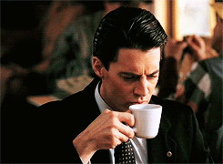

---
output:
  md_document:
    variant: markdown_github
---

<!-- README.md is generated from README.Rmd. Please edit that file -->

```{r, echo = FALSE}
knitr::opts_chunk$set(
  collapse = TRUE,
  comment = "#>",
  fig.path = "figure/",
  fig.height = 1
)
```

# Damn Fine Color Palettes


> That's a damn fine plot, Diane - Special Agent Dale Cooper (probably)

The wesanderson package claimed that "Short of adding an owl and dressing up your plot in a bowler hat, here's the most indie thing you can do to one." So I took them up on that challenge and made the damnfinecolorpalette where the owls are not what they seem. First round of palettes derived from the video [Color By Numbers: Twin Peaks.](https://vimeo.com/218231355), the instagram [colorpalatte.cinema](https://www.instagram.com/colorpalette.cinema/), and the use for a color picker extension and screenshots. Concept and code based on the wonderful wesanderson palette generator. 


## Installation


__Development version__

```{r, eval=FALSE}
devtools::install_github("fbenamy/damnfinecolorpalette")
```

## Usage

```{r, palettes_dummy}
library(damnfinecolorpalette)

# See all palettes
names(damnfinecolors)
```

## Palettes

### The Red Room

```{r, RedRoom}
damnfine("RedRoom1")
damnfine("RedRoom2")
```

### Becky Briggs
```{r}
damnfine("BeckyBriggs")
```

### The Lumber Mill
```{r, rushmore}
damnfine("LumberMill")
```

### Phone Booth 
```{r}
damnfine("PhoneBooth")
``` 

### PeteMartell 
```{r}
damnfine("PeteMartell")
```

### One Eyed Jacks

```{r, OneEyedJacks}
damnfine("OneEyedJacks")
```

### RR Diner

```{r, RRDiner}
damnfine("RRDiner")
```

### Dougie

```{r, Dougie}
damnfine("Dougie")
```  

### Audrey Horne

```{r, Audrey Horne}
damnfine("AudreyHorne")
```

```{r, ggplot1, fig.height = 3}
library("ggplot2")
ggplot(mtcars, aes(factor(cyl), fill=factor(vs))) +  geom_bar(color = "black") +
  scale_fill_manual(values = damnfine("AudreyHorne"))
```

### The Log Lady 

```{r, Log Lady}
damnfine("LogLady")
```

```{r, volcano, fig.height = 3}
pal <- damnfine("LogLady", 21, type = "continuous")
image(volcano, col = pal)
```

```{r, log_lady_heatmap, fig.height = 3}
pal <- damnfine("LogLady", 100, type = "continuous")
# heatmap is a local dataset
ggplot(heatmap, aes(x = X2, y = X1, fill = value)) +
  geom_tile() + 
  scale_fill_gradientn(colours = pal) + 
  scale_x_discrete(expand = c(0, 0)) +
  scale_y_discrete(expand = c(0, 0)) + 
  coord_equal() 
```

### Special Agent 

```{r, specialagent}
damnfine("SpecialAgent")
```

