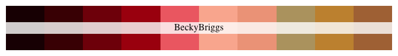
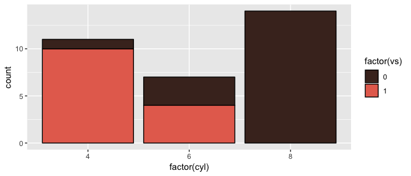
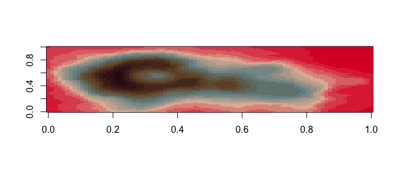
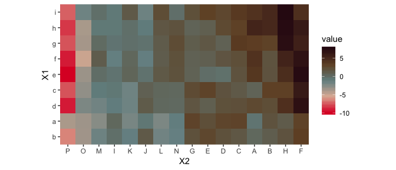

<!-- README.md is generated from README.Rmd. Please edit that file -->
Damn Fine Color Palettes
========================


> That's a damn fine plot, Diane - Special Agent Dale Cooper (probably)

The wesanderson package claimed that "Short of adding an owl and dressing up your plot in a bowler hat, here's the most indie thing you can do to one." So I took them up on that challenge and made the damnfinecolorpalette where the owls are not what they seem. First round of palettes derived from the video [Color By Numbers: Twin Peaks.](https://vimeo.com/218231355), the instagram [colorpalatte.cinema](https://www.instagram.com/colorpalette.cinema/), and the use for a color picker extension and screenshots. Concept and code based on the wonderful wesanderson palette generator.

Installation
------------

**Development version**

``` r
devtools::install_github("fbenamy/damnfinecolorpalette")
```

Usage
-----

``` r
library(damnfinecolorpalette)

# See all palettes
names(damnfinecolors)
#>  [1] "RedRoom1"     "RedRoom2"     "BeckyBriggs"  "LumberMill"  
#>  [5] "PhoneBooth"   "PeteMartell"  "OneEyedJacks" "RRDiner"     
#>  [9] "Dougie"       "AudreyHorne"  "LogLady"      "SpecialAgent"
```

Palettes
--------

### The Red Room

``` r
damnfine("RedRoom1")
```


``` r
damnfine("RedRoom2")
```


### Becky Briggs

``` r
damnfine("BeckyBriggs")
```



### The Lumber Mill

``` r
damnfine("LumberMill")
```


### Phone Booth

``` r
damnfine("PhoneBooth")
```


### PeteMartell

``` r
damnfine("PeteMartell")
```


### One Eyed Jacks

``` r
damnfine("OneEyedJacks")
```


### RR Diner

``` r
damnfine("RRDiner")
```


### Dougie

``` r
damnfine("Dougie")
```


### Audrey Horne

``` r
damnfine("AudreyHorne")
```


``` r
library("ggplot2")
ggplot(mtcars, aes(factor(cyl), fill=factor(vs))) +  geom_bar(color = "black") +
  scale_fill_manual(values = damnfine("AudreyHorne"))
```



### The Log Lady

``` r
damnfine("LogLady")
```


``` r
pal <- damnfine("LogLady", 21, type = "continuous")
image(volcano, col = pal)
```



``` r
pal <- damnfine("LogLady", 100, type = "continuous")
# heatmap is a local dataset
ggplot(heatmap, aes(x = X2, y = X1, fill = value)) +
  geom_tile() + 
  scale_fill_gradientn(colours = pal) + 
  scale_x_discrete(expand = c(0, 0)) +
  scale_y_discrete(expand = c(0, 0)) + 
  coord_equal() 
```



### Special Agent

``` r
damnfine("SpecialAgent")
```


